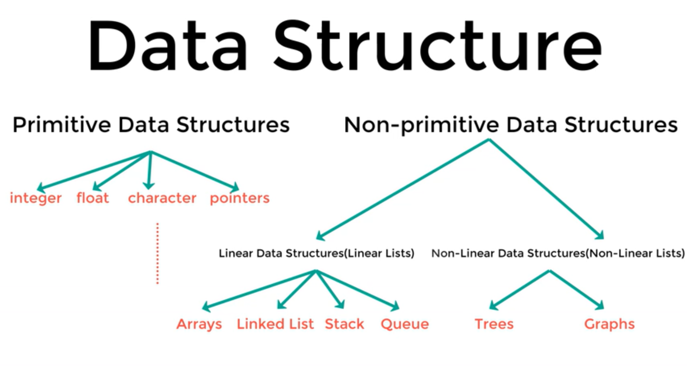

# Data-Structures

---

- data structure: is data organization, management and storage format that enables efficient access and modification

## Important aspects

1. access
2. insertion
3. deletion
4. search

## Advantages of  DS

1. High performance
2. More efficient

>
> ### Properties of each DS
>
> - some of them is perfect for access
   ex: array
> - array is not good for addition and deletion
> - array is size-fixed
> - LinkedList: not size-fixed, easy for addition and deletion

#### Aim

- choosing the Appropriate DataStructure when facing any problem
- studying some prebuilt data structures and analyzing the cons and pros for each one.

#### Types of data structures

1. **Primitive data structures**
   1. integer
   2. float
   3. character
   4. pointers
2. **non-primitive data structures** 
   1. **Linear DSs(Linear lists)**
      1. arrays
      2. LinkedList
      3. stack
      4. queue
   2. **non-linear DSs(non-linear lists)**
      1. Trees
      2. graphs

<!--  -->

---

