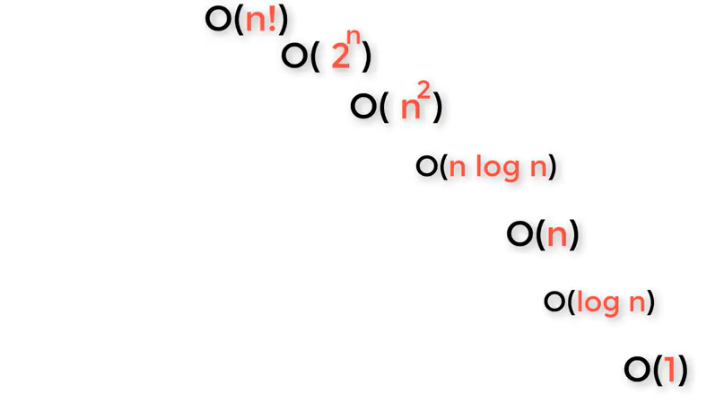
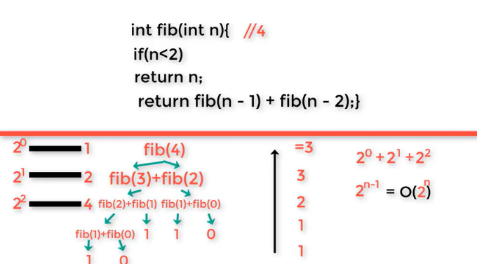

# Complexity

---

- how much time and space would any program take.

## Search

- an algorithm would work to solve any problem

## Time Complexity

  1. best case (**Ω** lower bound)
  2. average case (**Θ** tight bound)
  3. worst case (**O** upper bound)

### Constant time

- operations
- definitions
- any thing that is not repetitive in n pattern.  

### Summation 1 ... N

to sum numbers from number 1 to N numbers in a linear time `n(n+1)/2`

### From Fast to Slow (ascending order)

>
> O(1) => O(log n) => O(n) => O(n log n) => o(n^2) => O(2^n) => O(n!)
>



#### Linear time vs Logarithmic time

if _n_= 100 => O(_n_) = 100, though o(_log n_)= o(_log 100_) = 2

#### Fibonacci sequence

- the number is the summation of the two preceding ones.

F<sub>0</sub> = 0, F<sub>1</sub> = 1

&nbsp;&nbsp;&nbsp;&nbsp;&nbsp;&nbsp;&nbsp;&nbsp;&nbsp;&nbsp;&nbsp;&nbsp;&nbsp;&nbsp;&nbsp;&nbsp;&nbsp;&nbsp;&nbsp;&nbsp;&nbsp;&nbsp;&nbsp;&nbsp;&nbsp;&nbsp;&nbsp;&nbsp;**F(n) = F<sub>n - 1</sub>  + F<sub>n - 2</sub>**

python code:

```

def fib(n):
    if(n < 2):
        return n
    return fib(n - 1) + fib(n - 2)

```

complexity for this code is O(2<sup>n</sup>)




---
