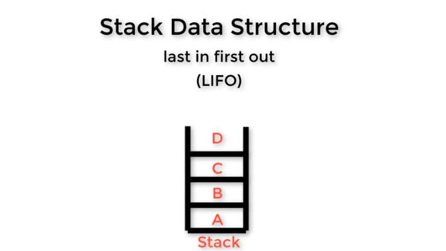
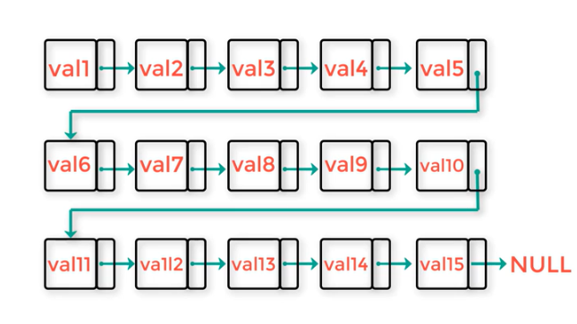
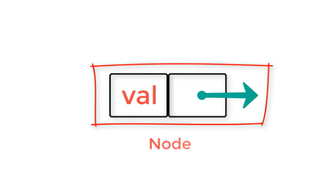
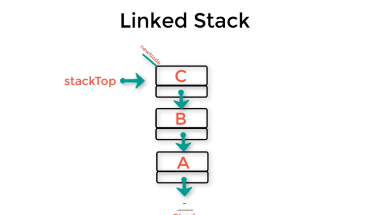
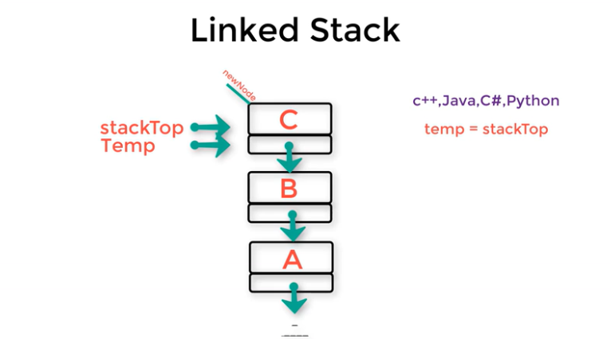
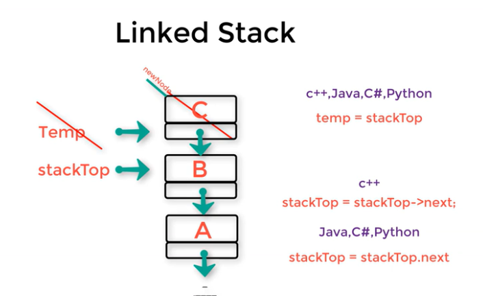

# Intro-to-stack

---

- Stack data structure is last in first out (LIFO)



- here we study stack as array with more options

- stack has a property called top which index the top of the stack
- top of the stack is commonly initialized with -1 and with the first addition it comes to 0

## Applications

- Redo: redo a deleted letter
  the deleted elements are added to stack
- back button in browser pages are saved into stack

## Stack using pointer

- using LinkedList



**pros**

1. not size-fixed like stack-array-based
2. each element have a pointer to the following element
3. value + pointer = node



ways of implementation
in c++

```
struct Node {
  Type Item;
  Node *next;
}
```

in java

```
class Node {
  Type Item
  Node next;
}
```

1. first node it's next will point to null.
2. all the other nodes their next points to the earlier node (where the top is).
3. the top will always points to the latest node added.

### To delete a node

1. create a temp pointer pointing at stack's top
2. move the stack's top to the next node (point to next)

<div align="center" style="display: flex;">



</div>

---
